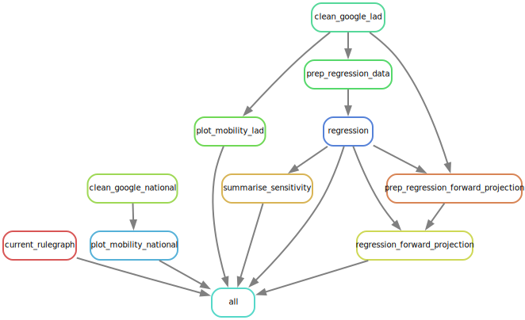

# wfh_paper

Code for paper comparing Google mobility data to Census 2021 work from home statistics.

## Usage

R scripts for conducting this analysis are located in the `src` directory.

The data dependencies and dependency relationships between scripts are defined in the `Snakefile`.

## Workflow diagram

